# 95888 DFP G2 Group 6 Final Project

## CityPulse - City Relocation Recommendation Application

### Team Members
**Kaixin Tian**     kaixint [at] andrew.cmu.edu  
**Louie Sun**       hongyuns [at] andrew.cmu.edu  
**Yanting Hu**      yantingh [at] andrew.cmu.edu  
**Zheng Zhang**     zhengzh2 [at] andrew.cmu.edu   
**Daochen Li**      daochenl [at] andrew.cmu.edu  

### App Information

CityPulse harnesses an extensive array of data, sourcing information from reputable platforms like Census.gov, Salary.com, WalletHub.com, etc.

The pivotal metrics encompass a spectrum of seven factors such as employment, cost, safety, recreation, etc. These metrics, carefully weighted and curated, empower users to navigate relocation decisions with a wealth of informed insights.

By regularly refreshing the data utilized within the application, CityPulse remains dynamic and aligned with the latest trends and conditions, offering users a consistently reliable tool for making well-informed decisions about their prospective relocations.

### Metrics and Sources 
1. Income: [Average Household Income](https://data.census.gov)
2. Employment: [Employment Rate](https://data.census.gov)
3. Cost:[Cost of Living Percentage](https://www.salary.com/research/cost-of-living/)
4. Safety: [Safety Index](https://www.numbeo.com/crime/rankings_current.jsp)
5. Medical: [Health Care Exp Index](https://www.numbeo.com/health-care/rankings_current.jsp)
6. Pollution: [Pollution Index](https://www.numbeo.com/pollution/rankings_current.jsp)
7. Recreation: [Recreation Total Score](https://wallethub.com/edu/best-worst-cities-for-recreation/5144)

### Steps To Install & Run
1. Download the entire zip package (say on Desktop) and unzip the package;
2. Go to the directory named CityPulse with main application named `CityPulse.py` (For example, if you put the entire package on Desktop, use `cd /Users/username/Desktop/CityPulse` to go to the directory);
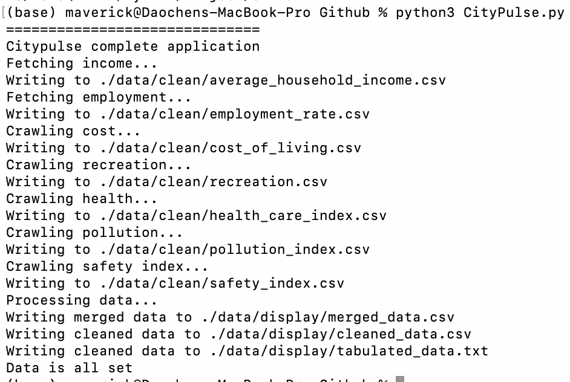
3. Run the application using terminal: `python3 CityPulse.py`, (this main program file imports other modules/code files that accomplish various parts of the overall application);
4. Or run `CityPulse.py` using IDEs such as PyCharm or Spyder.

### Additional Setup Information
1. No additional module needed;
2. API key for Census.gov in `average_household_income.py` and `employment_rate.py` are hardcoded into the .py files, no need to obtain further;
3. `cost_of_living.py` might take a few longer than other crawlers, but within minutes;
4. IP may be banned running `recreation.py` for many times, try using VPN or Hotspot;
5. Fresh data is included in `./data directory`, run `./gui/ui.py` to skip the download.
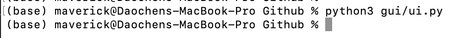

### App Demo

#### Home Screen
This window would pop up if the program runs successfully.
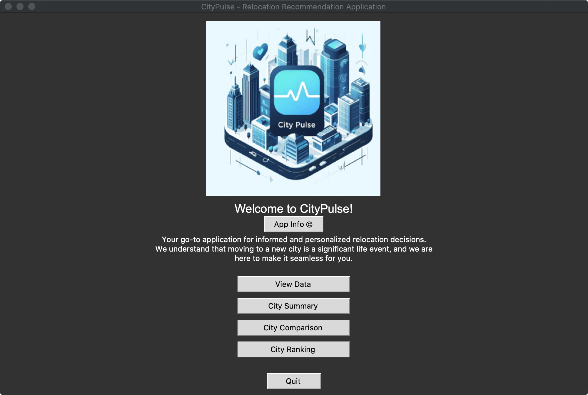

#### App Info
Click on App Info for application description and metrics description.
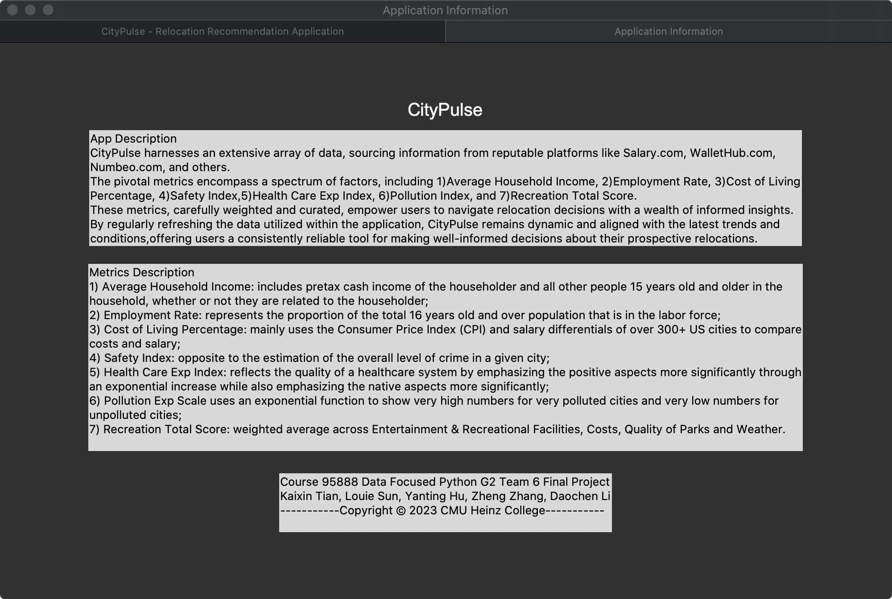

#### View Data
Click on View Data to view the tabulated data.
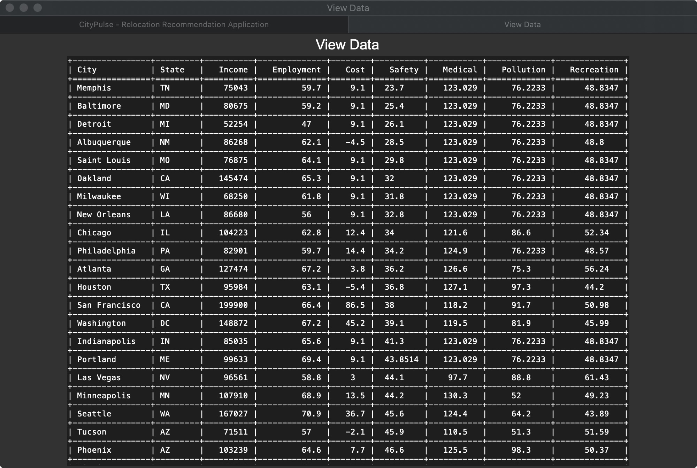

#### City Summary
Click on City Summary and input city for its metrics summary.
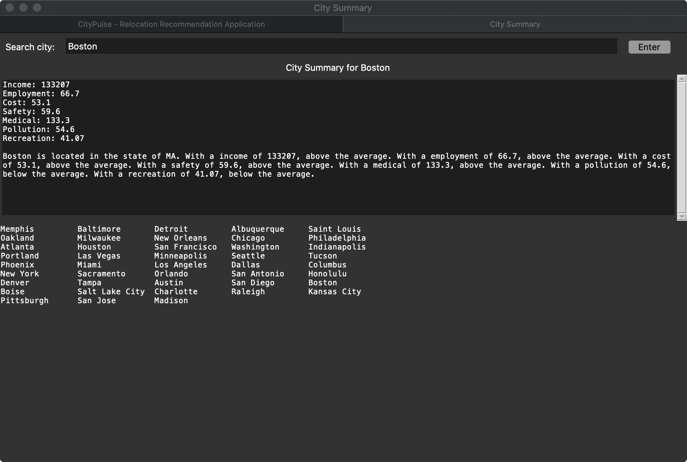
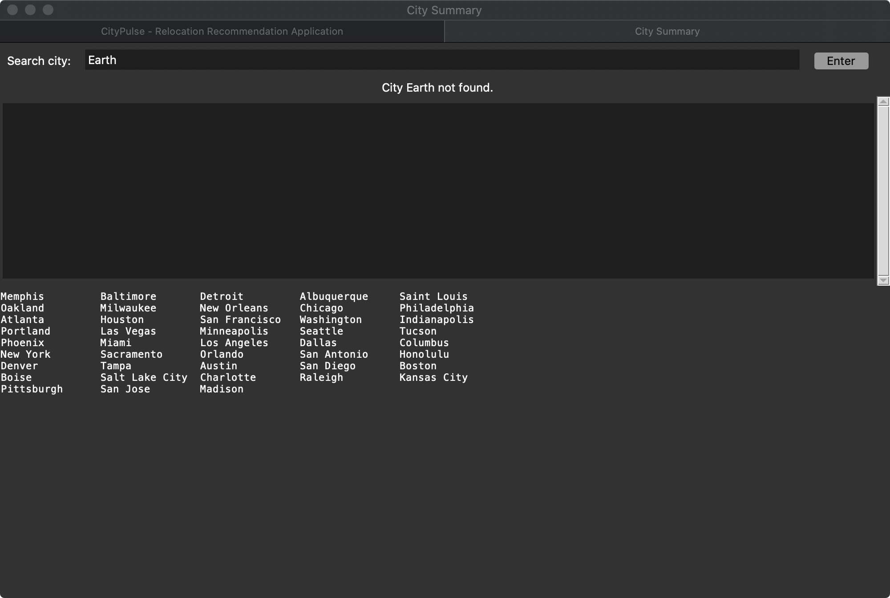

#### City Comparison
Click on City Comparison for histograms of metrics across all cities.
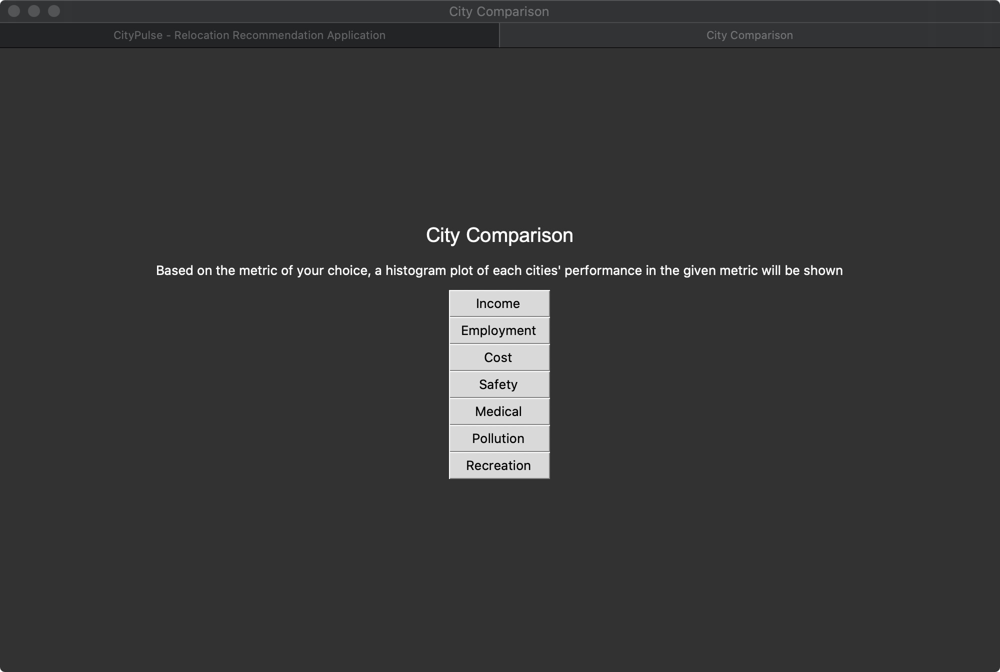
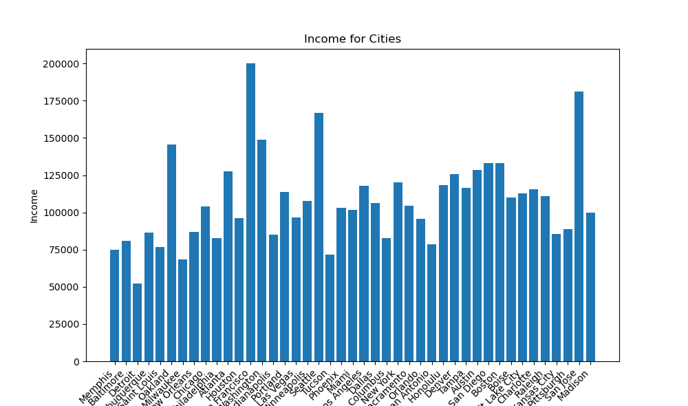
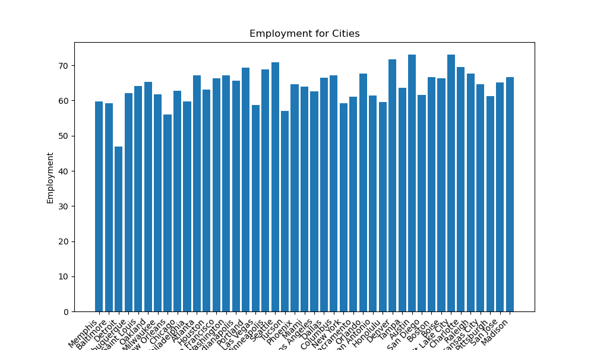

#### City Ranking
Click on City Ranking for ranking based on default weightings or ranking based on your preferences.
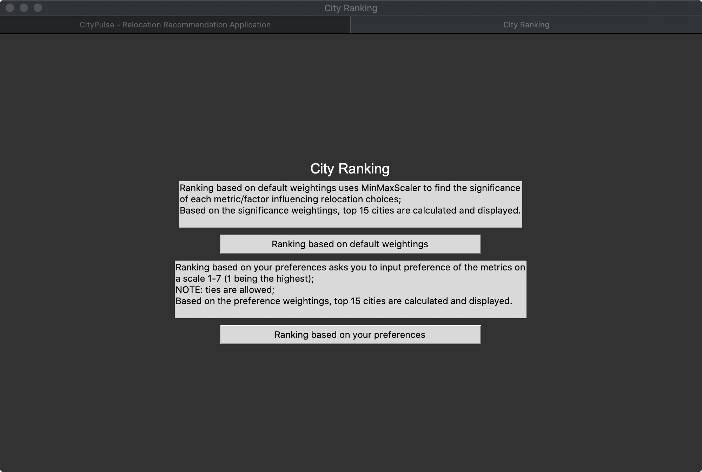

Here is the output for ranking based on default weightings.
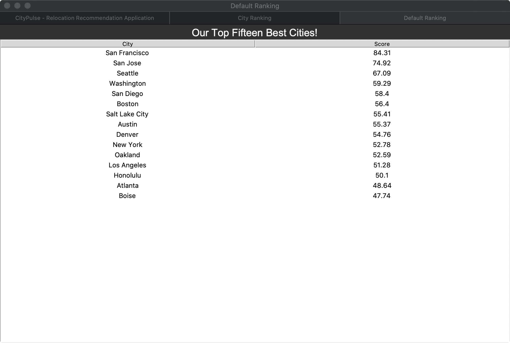

A demo for ranking based on user’s preference is shown below. The output is similar as above.
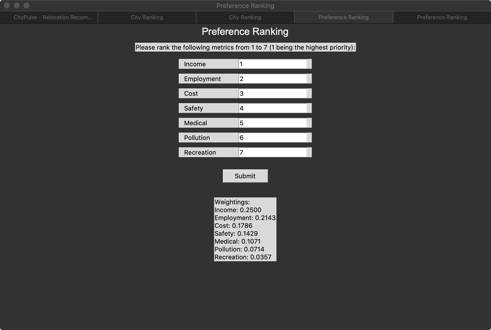